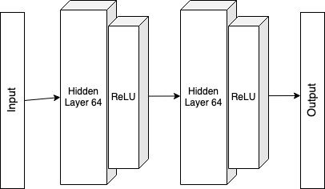

# Project 1 : Navigation

### Implementation

Many algorithm have been implemented to solve this problem. Among the cutting-edge deep reinforcement learning algorithms tried are :

*  Deep Q-Nerwork (DQN)
*  Double Deep Q-Network
*  Dueling Q-Network
*  Prioritized Experience Replay

#### Deep Q-Network

For more information see [Human-level control through deep reinforcement learning, Mnih and others](https://storage.googleapis.com/deepmind-media/dqn/DQNNaturePaper.pdf).

The implementation relies on using Experience Replay and Fixed Q-Targets. 

The dense neural network used has 2 hidden fully-connected (FC) layers, 64 nodes each one. This model solved the environment in 415 episodes.

### Double Deep Q-Network

Implementing double deep Q-Network helps to avoid the overestimation appearing in Deep Q-Network. Using this technics gave the same result for this case study and only solved the environment quicker.
This method appeared for the first time in the DeepMind paper [Deep Reinforcement Learning with Double Q-learning, Hasselt and others](https://arxiv.org/pdf/1509.06461.pdf)

