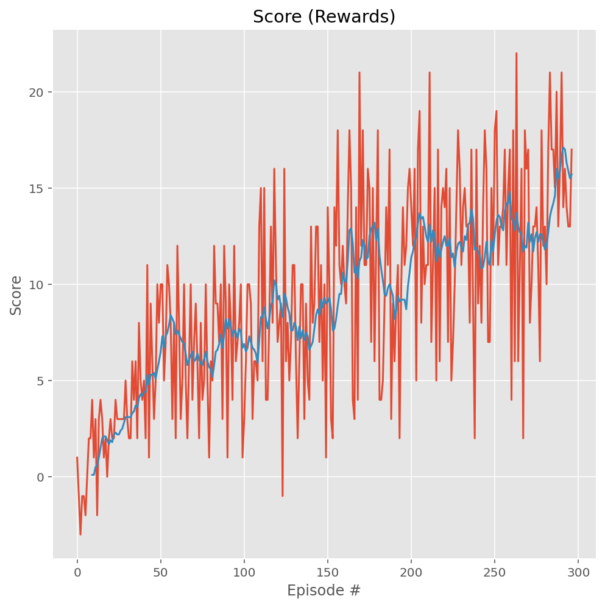
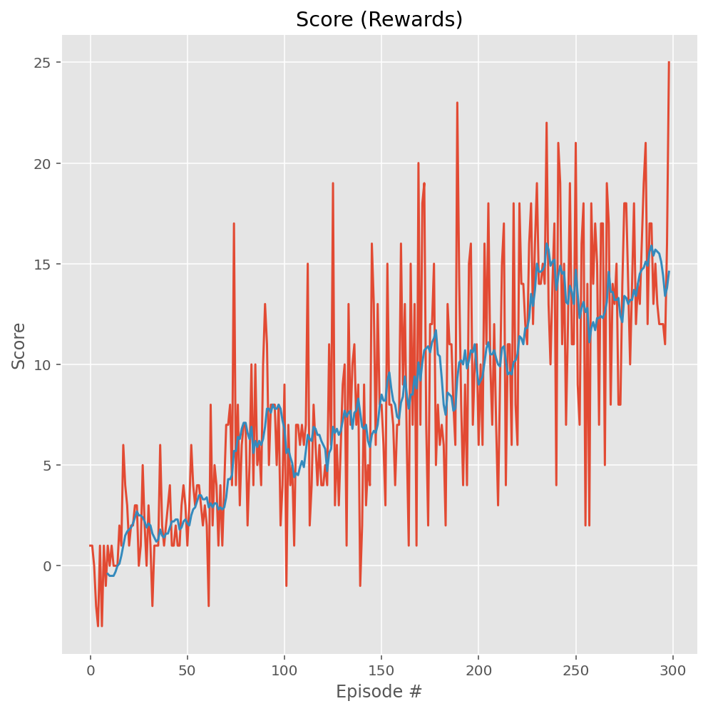
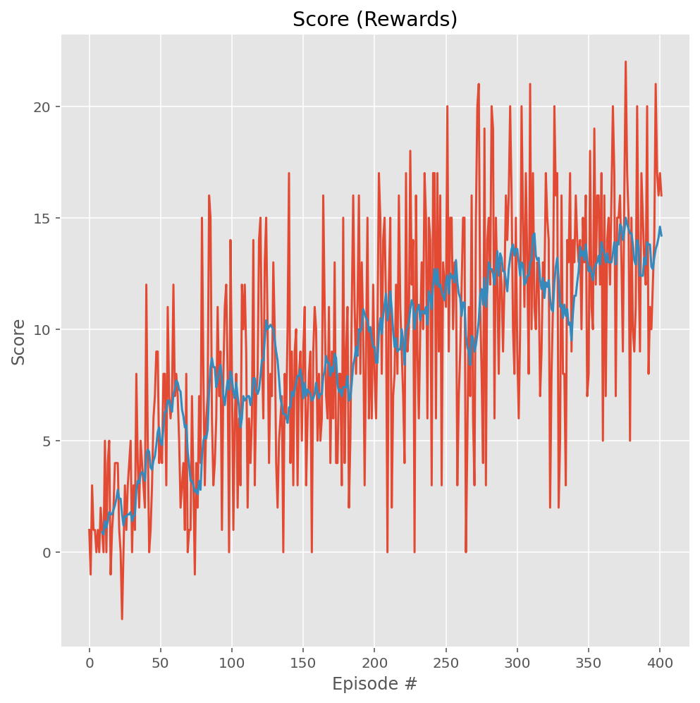
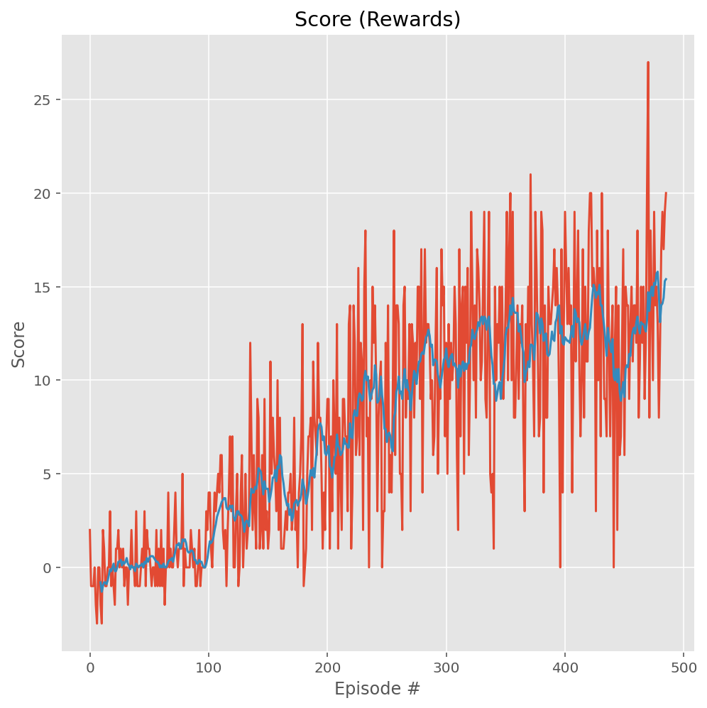
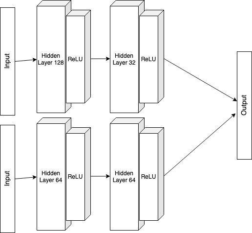

# Project 1 : Navigation

To see the images, use the md file.

### Implementation

Many algorithm have been implemented to solve this problem. Among the cutting-edge deep reinforcement learning algorithms tried are :

*  Deep Q-Nerwork (DQN)
*  Double Deep Q-Network
*  Dueling Q-Network
*  Prioritized Experience Replay

To use this algorithm and combination of them go to the `agent.py` file and change `False` value to `True` to the corresponding choice.

#### Deep Q-Network

For more information see [Human-level control through deep reinforcement learning, Mnih and others](https://storage.googleapis.com/deepmind-media/dqn/DQNNaturePaper.pdf).

The implementation relies on using Experience Replay and Fixed Q-Targets. 

The dense neural network used has 2 hidden fully-connected (FC) layers, 64 nodes each one. This model solved the environment in 197 episodes.

#### Double Deep Q-Network

Implementing double deep Q-Network helps to avoid the overestimation appearing in Deep Q-Network. This method is implemented changing the TD target in the update rule for function approximation.
The TD target from :
$$R + \gamma\max_a \hat{q}(S',a,w)$$
to:
$$R + \gamma\hat{q}(S',\arg\max_a \hat{q}(S',a,w),w)$$

Using this technics gave the same result for this case study and only solved the environment in the same amount of time 199 episodes.
This method appeared for the first time in the DeepMind paper [Deep Reinforcement Learning with Double Q-learning, Hasselt and others](https://arxiv.org/pdf/1509.06461.pdf)

#### Prioritized Experience Replay 

An idea to improve learning with buffer replay is that the agent will better take advantage of experience replay if he takes more time to look at previous experience were more information is to gain. Using this method the algorithm reached to 13 in 352 episodes. See [Prioritized Experience Replay, Schaul and others](https://arxiv.org/pdf/1511.05952.pdf) for lore information (again from DeepMind).

#### Dueling Q-Network

The last algorithm used here is the Dueling Q-Network. The idea is to use two stream, one that estimate the state value function and one that estimate the advantage foe each action. The stream may share some layers. In our case they don't. The *Q* value is then found using both state and advantage value. 
$$\text{State values: }V(s) \text{ and } \text{ Advantage values: } A(s,a)$$
$$Q(s,a) = V(s) + A(s,a)$$

Using this method the algorithm reached to 13 in 386 episodes.

[Dueling Network Architectures for Deep Reinforcement Learning, Wang and others](https://arxiv.org/pdf/1511.06581.pdf)

The network used is as follow :

### Hyperparameters

Many hyperparameters have been tested to find the most suitaible ones. More twecking is certainly possible. 

1. The number of episodes was initially set to 2000 but as soon as the goal was reached the algorithm stoped to prevent to much computing time.
2. The discount factor was set to 0.99 and stayed at this value since experimentation with other value did not ended in better result.
3.  I tried different combination for the $\epsilon$-greedy strategy and finally found that in my case $\epsilon_{start} = 0.1$ and $\epsilon_{end}=0.001$ with a decay rate of $0.857$ was best.

### Future improvement

Future improvement will go in implementing this exercice but using pixel grid as input to learn in first person as a human would. This will allow me the use Convolutional Neural Network to perform this task. 
Some other than *Dueling Q-Network etc...* algorithm could also be tried as **Rainbow** etc...